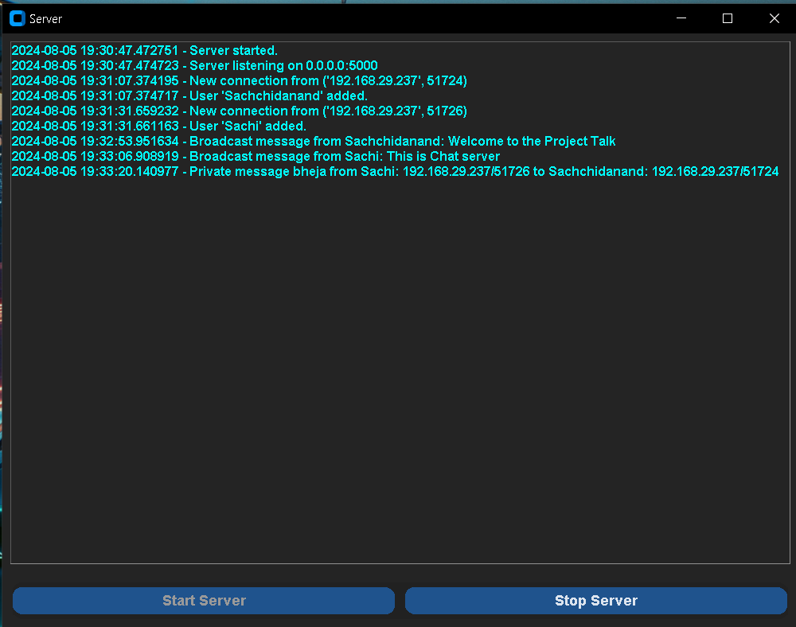
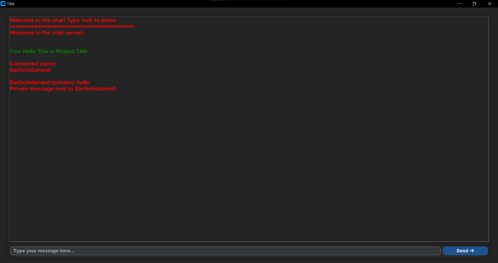

# 🚀 Chat Server and Client Application

Welcome to the Chat Server and Client Application! This Python-based chat system facilitates real-time communication between users and is perfect for internal communication within institutions and companies. It utilizes the `socket` library for networking and `customtkinter` for a modern GUI.

## 🛠 Technologies Used

- **Socket**: Manages network communication between server and clients.
- **Threading**: Allows concurrent client handling.
- **CustomTkinter**: Enhances Tkinter for a modern UI experience.
- **Datetime**: Used for timestamping log entries.

## 🎥 Tutorial Video

For a visual guide on setting up and using the Chat Server and Client Application, check out our [Tutorial Video](#).

## 🖼 Screenshots

### Chat Server Interface



### Chat Client Interface



## 🌟 Features

- **Start and Stop Server**: Manage server operations effortlessly.
- **User Login**: Unique usernames for client access.
- **List Connected Users**: Retrieve a list of currently connected users.
- **Private Messaging**: Send direct messages to other users.
- **Broadcast Messaging**: Share messages with all connected users.
- **Connection Logging**: Track connection and disconnection events with timestamps.

## 💻 Code Explanation

### 🖥️ Server Code

#### `handle_client`

Handles client interactions and message processing:

1. **Logging New Connections**
   ```python
   self.log_message(f"{datetime.now()} - New connection from {client_address}")
   ```
   Requests a username from the client.

2. **Checking Username Uniqueness**
   ```python
   with clients_lock:
       if username in clients:
           client_socket.sendall(b"Username already taken. Please choose another one.\n")
           client_socket.close()
           return
       else:
           clients[username] = (client_socket, client_address)
           self.log_message(f"{datetime.now()} - User '{username}' added.")
           client_socket.sendall(b"Welcome to the chat server!\n")
   ```
   Ensures the username is unique and registers it if available.

3. **Processing Incoming Messages**
   ```python
   while True:
       try:
           message = client_socket.recv(1024).decode('utf-8')
           if not message:
               break
   ```
   Receives and processes messages from the client.

4. **Handling Special Commands**

   i. *Listing Connected Users*
   ```python
   if message.startswith('?list'):
       user_list = '\n'.join(clients.keys())
       client_socket.sendall(f"\nConnected users:\n{user_list}\n".encode('utf-8'))
   ```
   Sends a list of currently connected users.

   ii. *Handling Private Messages*
   ```python
   elif message.startswith('@'):
       parts = message[1:].split(' ', 1)
       if len(parts) == 2:
           target_username, private_message = parts
           with clients_lock:
               if target_username in clients:
                   target_socket, target_address = clients[target_username]
                   target_socket.sendall(f"{username} (private): {private_message}".encode('utf-8'))
                   client_socket.sendall(f"Private message sent to {target_username}\n".encode('utf-8'))
                   self.log_message(f"{datetime.now()} - Private message sent from {username}: {client_address}/{client_address[1]} to {target_username}: {target_address}/{target_address[1]}")
               else:
                   client_socket.sendall(f"User {target_username} not found".encode('utf-8'))
       else:
           client_socket.sendall("Invalid private message format. Use @username message".encode('utf-8'))
   ```
   Handles private messages and logs the details.

   iii. *Broadcasting Messages*
   ```python
   else:
       broadcast_message = f"{username}: {message}"
       with clients_lock:
           for client, _ in clients.values():
               if client != client_socket:
                   client.sendall(broadcast_message.encode('utf-8'))
       self.log_message(f"{datetime.now()} - Broadcast message from {username}: {message}")
   ```
   Broadcasts messages to all connected users.

   iv. *Handling Disconnections*
   ```python
   except ConnectionResetError:
       break
   with clients_lock:
       if username in clients:
           del clients[username]
           self.log_message(f"{datetime.now()} - User '{username}' removed.")
   client_socket.close()
   ```
   Cleans up when a client disconnects.

### 🖥️ Client Code

#### Connecting to the Server
```python
def connect_to_server(self):
    self.client_socket = socket.socket(socket.AF_INET, socket.SOCK_STREAM)
    try:
        self.client_socket.connect((self.server_ip, self.server_port))
    except Exception as e:
        ctk.CTkMessageBox(title="Connection Error", message=f"Error connecting to server: {e}")
        self.destroy()
        return
    self.client_socket.sendall(self.username.encode('utf-8'))
    response = self.client_socket.recv(1024).decode('utf-8')
    if response == "Username already taken. Please choose another one.":
        ctk.CTkMessageBox(title="Username Error", message=response)
        self.destroy()
        return
    self.display_message("Welcome to the chat! Type 'exit' to leave.\n" + "="*40 + "\n", "received")
    receive_thread = threading.Thread(target=self.receive_messages)
    receive_thread.daemon = True
    receive_thread.start()
```
Connects to the server and sends the username.

#### Sending Messages
```python
def send_message(self, event=None):
    message = self.message_entry.get()
    if message:
        if not self.client_socket:
            ctk.CTkMessageBox(title="Error", message="Not connected to server.")
            return
        if message.lower() == 'exit':
            self.client_socket.sendall(message.encode('utf-8'))
            self.client_socket.close()
            self.destroy()
        elif message.startswith('@'):
            parts = message[1:].split(' ', 1)
            if len(parts) == 2:
                target_username, msg_to_send = parts
                self.client_socket.sendall(f"@{target_username} {msg_to_send}".encode('utf-8'))
            else:
                self.display_message("Invalid private message format. Use @username message\n", "received")
        elif message.startswith('?list'):
            self.client_socket.sendall(message.encode('utf-8'))
        else:
            self.client_socket.sendall(message.encode('utf-8'))
            self.display_message(f"\nYou: {message}\n", "sent")
            self.message_entry.delete(0, "end")
```
Sends different types of messages to the server (public, private, list).

#### Receiving Messages
```python
def receive_messages(self):
    while True:
        try:
            message = self.client_socket.recv(1024).decode('utf-8')
            if not message:
                break
            self.display_message(message + "\n", "received")
```
Receives and displays messages from other clients.

#### Displaying Messages
```python
def display_message(self, message, tag):
    self.chat_display.configure(state="normal")
    if tag == "sent":
        color = "green"
    elif tag == "received":
        color = "red"
    else:
        color = "white"
    self.chat_display.insert("end", message, (tag,))
    self.chat_display.tag_configure(tag, foreground=color)
    self.chat_display.configure(state="disabled")
    self.chat_display.see("end")
```
Inserts and colors messages in the chat window based on the message type.

## 📬 Contact

**Support Contact**: For any issues, please contact [sachi20120227@gmail.com](mailto:sachi20120227@gmail.com)

*Made by Miu ALfha Product.*
